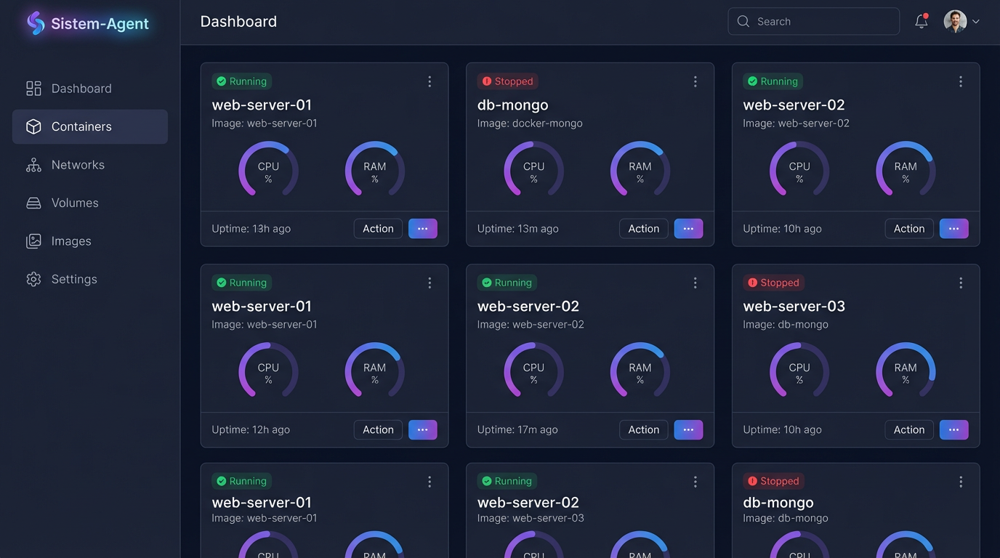
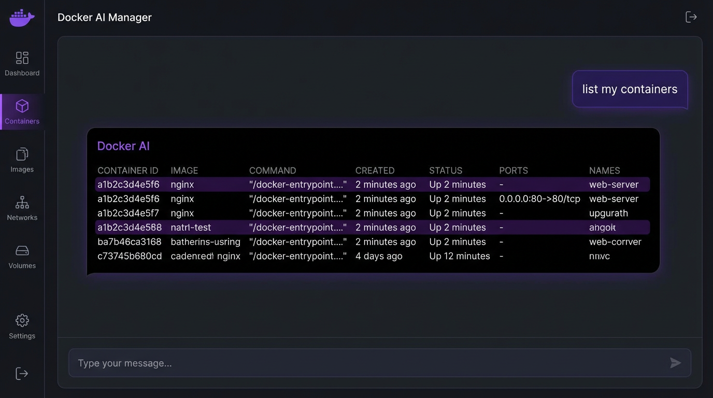
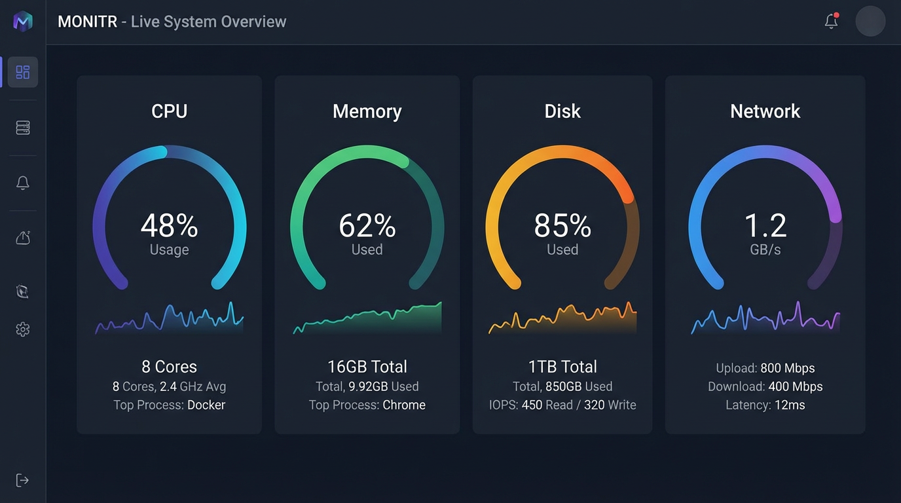

# Sistem-Agent 🤖

<p align="center">
  <strong>Portainer meets ChatGPT — Gerencie Docker com inteligência artificial</strong>
</p>

<p align="center">
  <a href="#-funcionalidades">Funcionalidades</a> •
  <a href="#-tecnologias">Tecnologias</a> •
  <a href="#-instalação">Instalação</a> •
  <a href="#-uso">Uso</a> •
  <a href="#-arquitetura">Arquitetura</a> •
  <a href="#-contribuindo">Contribuindo</a>
</p>

---

## 📸 Screenshots

| Dashboard | AI Chat | Monitoramento |
|:---------:|:-------:|:-------------:|
|  |  |  |
| Visão geral dos containers e recursos do sistema | Converse com a IA para gerenciar tudo via linguagem natural | CPU, memória, disco e rede em tempo real |

---

## 🚀 O que é o Sistem-Agent?

O **Sistem-Agent** é uma plataforma open-source que combina gerenciamento Docker com inteligência artificial. Em vez de decorar comandos `docker` complexos, simplesmente **converse com a IA** e ela executa as ações por você.

Ideal para:
- **DevOps** que querem agilidade no dia a dia
- **Desenvolvedores** que não querem decorar CLI Docker
- **Admins de servidor** que precisam de monitoramento centralizado
- **Equipes** que buscam uma interface amigável para Docker

## ✨ Funcionalidades

### 🐳 Gerenciamento Docker Completo
| Recurso | Descrição |
|---------|-----------|
| **Containers** | Listar, iniciar, parar, reiniciar e remover |
| **Logs** | Visualização em tempo real com parsing correto |
| **Imagens** | Listagem com tamanho e data de criação |
| **Volumes** | Gerenciamento de volumes persistentes |
| **Redes** | Visualização de redes Docker e subnets |
| **Estatísticas** | CPU e memória por container |

### 🧠 Chat com IA Integrado
- **Comandos em linguagem natural** — "pare o container nginx", "me mostre os logs do app"
- **Múltiplos provedores** — OpenAI (GPT-4) ou Ollama (local, sem custo)
- **Contexto automático** — a IA conhece o estado atual do seu servidor
- **Diagnóstico inteligente** — análise de logs e sugestão de soluções
- **Automação** — execute tarefas complexas com uma frase

### 📊 Monitoramento em Tempo Real
- **CPU** — uso geral e por core
- **Memória** — utilizado, livre, cache
- **Disco** — uso por partição com barras de progresso
- **Rede** — tráfego de entrada/saída por interface
- **Auto-refresh** — dados atualizados a cada 5 segundos

### 🔧 Sistema & Infraestrutura
- **Monitoramento de erros** — envio automático para servidor centralizado
- **GitHub Issues automáticas** — erros críticos viram issues no GitHub
- **WebSocket em tempo real** — atualizações instantâ via Socket.IO
- **Interface responsiva** — funciona em desktop e mobile
- **Tema dark profissional** — UI moderna com TailwindCSS

## 🛠️ Tecnologias

| Camada | Tecnologia |
|--------|-----------|
| **Backend** | Node.js 18+, Express, Dockerode, Socket.IO |
| **Frontend** | Next.js 14 (App Router), React, TailwindCSS |
| **IA** | OpenAI API (GPT-4), Ollama (local) |
| **DevOps** | Docker, Docker Compose, Make |
| **Monitoramento** | systeminformation, Winston |
| **Deploy** | Linux (x86, ARM64/OrangePi) |

## 🏗️ Arquitetura

```
┌─────────────────────────────────────────────────────────┐
│                    Sistem-Agent                          │
├──────────────────┬──────────────────────────────────────┤
│   Frontend       │          Backend                      │
│   (Next.js)      │        (Express + Socket.IO)          │
│   Port: 3000     │        Port: 3000 (API)              │
├──────────────────┼──────────────────────────────────────┤
│ • Dashboard      │ • Docker Service (Dockerode)         │
│ • Containers     │ • AI Service (OpenAI / Ollama)       │
│ • Imagens        │ • System Monitor                     │
│ • Volumes        │ • Error Monitor                      │
│ • Redes          │ • GitHub Issue Creator               │
│ • Chat IA        │ • WebSocket Handlers                 │
│ • Settings       │ • Logger (Winston)                   │
│ • System Info    │ • Health Check                       │
└────────┬─────────┴──────────────┬───────────────────────┘
         │                        │
         ▼                        ▼
    Navegador              Docker Socket
    (Browser)              (/var/run/docker.sock)
```

## 📦 Instalação

### Pré-requisitos

| Requisito | Versão |
|-----------|--------|
| Docker | 20.10+ |
| Docker Compose | 2.0+ |
| Node.js (dev only) | 18+ |
| RAM | 2GB+ |
| Disco | 1GB+ |

### Instalação Rápida (Servidor Linux)

```bash
# Clone o repositório
git clone https://github.com/Jailtonfonseca/sistem-agent.git
cd sistem-agent

# Configure o ambiente
cp .env.example .env
nano .env  # Edite com suas configurações

# Inicie tudo com Docker Compose
docker-compose up -d
```

Pronto! Acesse em **`http://localhost:3000`**

### Instalação no Servidor (OrangePi / Raspberry Pi)

```bash
# Execute o script de instalação automática
bash install-server.sh
```

> O script configura Docker, variáveis de ambiente, systemd services e acesso via domínio.

### Instalação para Desenvolvimento

```bash
# Backend
cd backend
npm install
cp .env.example .env
npm run dev

# Frontend (outro terminal)
cd frontend
npm install
npm run dev
```

## ⚙️ Configuração

### Variáveis de Ambiente

```env
# ===== Backend =====
PORT=3000
DOCKER_SOCKET=/var/run/docker.sock

# AI Provider: openai | ollama
AI_PROVIDER=openai
OPENAI_API_KEY=sk-your-key-here
OPENAI_MODEL=gpt-4

# Ollama (AI_PROVIDER=ollama)
OLLAMA_BASE_URL=http://localhost:11434
OLLAMA_MODEL=llama3.2

# Monitoramento de Erros (opcional)
ERROR_MONITOR_URL=http://your-server:8080/api/errors

# ===== Frontend =====
NEXT_PUBLIC_API_URL=http://localhost:3000/api
```

### Configuração da IA

| Provedor | Custo | Setup |
|----------|-------|-------|
| **OpenAI GPT-4** | ~$0.03/req | Adicione `OPENAI_API_KEY` no `.env` |
| **Ollama (local)** | Gratuito | Instale Ollama e defina `AI_PROVIDER=ollama` |

> **Recomendação:** Use Ollama para uso local/privado e OpenAI para melhor qualidade de resposta.

### GitHub Issues Automáticas

1. Acesse **Settings** na interface
2. Insira o repositório (`username/repo`)
3. Gere um token em [GitHub Settings → Tokens](https://github.com/settings/tokens) com escopo `repo`
4. Cole o token no campo correspondente

Erros críticos agora criam issues automaticamente!

## 📖 Uso

### 1. Dashboard
Visão geral com containers rodando, imagens, volumes e uso de recursos.

### 2. Gerencie Containers
- Navegue até **Containers** no menu lateral
- Veja todos os containers com status, imagem e uptime
- Use os botões ▶️ ⏹️ 🔄 🗑️ para controlar cada container
- Clique em **Logs** para ver o output em tempo real

### 3. Chat com IA
Converse em português para gerenciar tudo:

```
"Liste os containers em execução"
"Pare o container nginx"
"Qual o consumo de memória do sistema?"
"Me mostre os logs do container app"
"Reinicie todos os containers parados"
```

### 4. Monitoramento
A página **System** mostra CPU, memória, disco e rede com atualização automática a cada 5 segundos.

## 🔌 Endpoints da API

| Método | Endpoint | Descrição |
|--------|----------|-----------|
| `GET` | `/api/docker/containers` | Lista todos os containers |
| `POST` | `/api/docker/containers/:id/start` | Inicia container |
| `POST` | `/api/docker/containers/:id/stop` | Para container |
| `POST` | `/api/docker/containers/:id/restart` | Reinicia container |
| `DELETE` | `/api/docker/containers/:id` | Remove container |
| `GET` | `/api/docker/containers/:id/logs` | Logs do container |
| `GET` | `/api/docker/images` | Lista imagens |
| `GET` | `/api/docker/volumes` | Lista volumes |
| `GET` | `/api/docker/networks` | Lista redes |
| `GET` | `/api/system/cpu` | Uso de CPU |
| `GET` | `/api/system/memory` | Uso de memória |
| `GET` | `/api/system/disk` | Uso de disco |
| `GET` | `/api/system/info` | Info do sistema |
| `POST` | `/api/chat/message` | Envia mensagem para IA |
| `GET` | `/api/chat/suggestions` | Sugestões de prompts |
| `GET` | `/api/health` | Health check |

## 🚧 Roadmap

- [ ] Autenticação de usuários (JWT)
- [ ] Terminal web integrado
- [ ] Gerenciador de arquivos do servidor
- [ ] Criação de containers via UI
- [ ] Templates de containers pré-configurados
- [ ] Backup e restauração automática
- [ ] Notificações push (Telegram, Discord)
- [ ] Suporte a Docker Swarm
- [ ] Multi-server management
- [ ] Internacionalização (EN/PT)

## 🤝 Contribuindo

Contribuições são muito bem-vindas! Siga os passos:

```bash
# 1. Fork o projeto
# 2. Crie uma branch
git checkout -b feature/minha-funcionalidade

# 3. Commit suas mudanças (use Conventional Commits)
git commit -m "feat: adiciona gerenciamento de volumes"

# 4. Push
git push origin feature/minha-funcionalidade

# 5. Abra um Pull Request
```

Leia [CONTRIBUTING.md](CONTRIBUTING.md) para mais detalhes.

## 📝 Licença

Este projeto está sob a licença MIT. Veja o arquivo [LICENSE](LICENSE) para detalhes.

## 🌐 Conecte-se

| Plataforma | Link |
|------------|------|
| 📸 Instagram | [@jailton_fon](https://instagram.com/jailton_fon) |
| 🎵 TikTok | [@fonsecac41](https://tiktok.com/@fonsecac41) |
| 🎮 Twitch | [fonsecac41](https://twitch.tv/fonsecac41) |
| 📺 YouTube | [@JailtonFonseca](https://www.youtube.com/@JailtonFonseca) |
| 💻 GitHub | [Jailtonfonseca](https://github.com/Jailtonfonseca) |

---

<p align="center">
  <strong>Feito com ❤️ por <a href="https://github.com/Jailtonfonseca">Jailton Fonseca</a></strong><br>
  <sub>🇧🇷 Brasil</sub>
</p>
